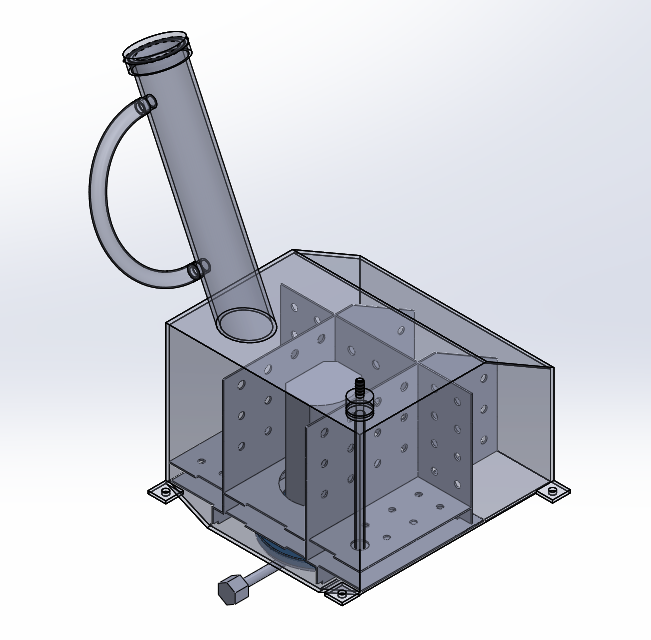
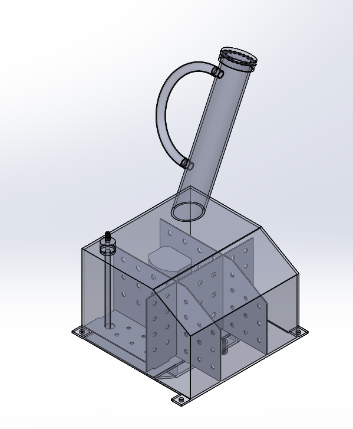
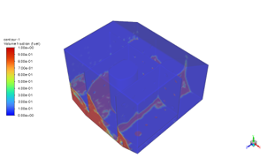
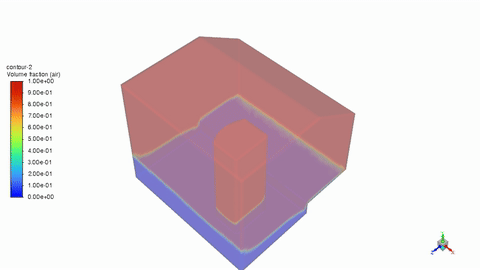
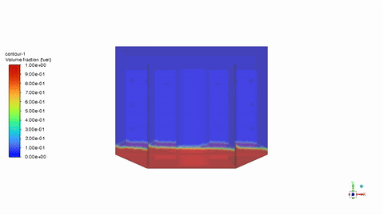
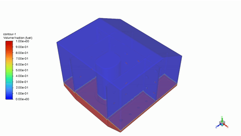
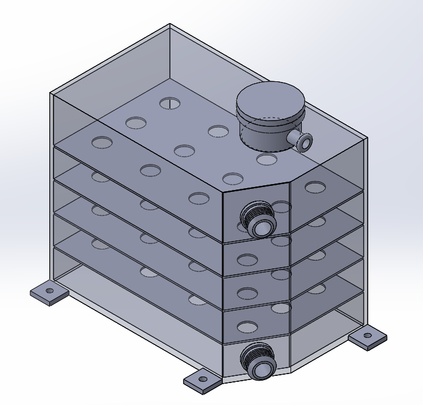
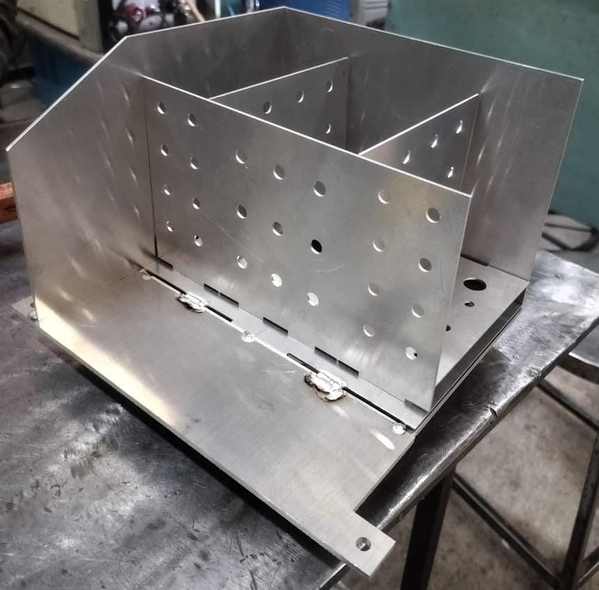

# Fuel & Dry-Sump Oil Tank Design — Powertrain Subsystem

**Ashwa Mobility Foundation | Formula Student**

Designed, analyzed, and manufactured the endurance-run fuel tank and dry-sump oil tank for the powertrain subsystem, coordinating cross-functional requirements between the powertrain and chassis sub-teams.

*Fuel tank assembly with internal baffle structure and filler neck*

---

## Overview

Formula Student endurance events demand a fuel system that survives sustained lateral acceleration without starving the engine, while fitting within tight chassis packaging limits. This project covers two linked components on the powertrain subsystem:

1. **Fuel tank** — sized against actual endurance-run fuel consumption, with internal baffling validated by CFD slosh simulation
2. **Dry-sump oil tank** — redesigned from first principles for the engine's dry-sump conversion, cutting volume while preserving safety margin

Both parts were carried from design through to physical manufacture.

---

## Fuel Tank Design

### Consumption Sizing — Cross-Validated Across Two Independent Methods

To size the tank correctly, fuel consumption for a full endurance run was estimated two separate ways and cross-checked against each other:

| Method | Approach | Result |
|---|---|---|
| **1. MoTec log-based** | Fuel injector duty cycle mapped against real RPM data from 10-minute MoTec test logs, extrapolated to the full 30.637-minute endurance run (with a 1.2 FOS on lap time) | 5,519.86 cc |
| **2. Simulation-based** | Duty cycle mapped against a full-lap RPM profile generated in OptimumLap for the Kari Motor Speedway track | 5,434.27 cc |

**Error between methods: 85.59 cc → 1.55%** — this close agreement gave confidence to size the new tank around real consumption data rather than a conservative guess.

### Old vs. New Tank

| Spec | Old Tank | New Tank |
|---|---|---|
| Gross volume | 6.534 L | 7.15 L |
| Baffles | None | 1mm Aluminium 6061 sheet baffles |
| Usable volume | 6.184 L | 6.77 L |
| Bottom reservoir | — | ~450 ml dedicated anti-starvation reservoir |

*Internal baffle and reservoir structure*

**Baffle hole sizing was deliberately asymmetric:** the bottom reservoir plate uses 6mm holes (restrictive, to hold fuel in the reservoir under slosh) while the upper baffle plates use 7mm holes (freer flow, since their job is structural damping rather than fuel retention). The fuel return line was also routed to dump directly into the bottom reservoir, reinforcing the anti-starvation strategy.

A **PTFE sight tube** is fitted to the fuel tank for visual level checks — PTFE resists long-term swelling and degradation from prolonged fuel contact, unlike cheaper clear plastics.

### Sealing Flange

A dedicated sealing flange interfaces the tank with the **GSX-R600 fuel pump**, machined from Aluminium 6061 to a 0.1mm tolerance. Its bolt pattern and bore were derived directly from the pump's mounting geometry, and the O-ring groove was sized using the Parker O-Ring Handbook to guarantee correct squeeze and prevent leak paths. Full reasoning in [DESIGN-DECISIONS.md](DESIGN-DECISIONS.md#sealing-flange--o-ring-groove).

### Slosh Simulation

A CFD slosh study validated that the baffle/reservoir design actually prevents fuel starvation under real cornering loads — not just in theory.

**Why the last 500m of the endurance lap:** fuel level is at its lowest late in an endurance run, which is exactly when pump starvation under slosh is most likely. Rather than simulating the full lap, the analysis focused on this worst-case low-fuel window, checking specifically whether the pump stays fed through hard cornering and braking events when there's the least fuel margin to work with.

**Setup:**
- Multiphase VOF model, surface tension coefficient 0.021 N/m
- Viscous model: RANS SST with corner flow correction and production limiter
- Solver: Fractional Step (pressure-velocity coupling), second-order upwind
- Mesh independence checked across two mesh densities (avg. aspect ratio 1.86–1.87, avg. orthogonal quality 0.75–0.76) to confirm results weren't mesh-dependent before trusting them
- Fuel volume simulated: the actual remaining fuel volume during the final 500m of the endurance lap
- Load case: 13.322 m/s² lateral acceleration (1.358g) — sourced from the suspension team's cornering targets, applied in the direction of worst-case slosh

*Fuel volume fraction contour, isometric view*

*Fuel volume fraction contour, cross-section view*

**Acceleration & braking:**

**Lateral cornering at 13.32 m/s² (1.358g):**

**Result:** fuel volume at the tank base stabilized around **31 ml**, just above the pump's actual draw requirement of 30.555 ml/s (derived from the GSX-R600 fuel pump's rated 110 L/hr flow). Base-region fuel velocity in the direction of slosh also remained stable — confirming the reservoir keeps the pump fed even under sustained lateral g, and during the acceleration/braking events of the low-fuel endgame of the run.

---

## Dry-Sump Oil Tank Design

Converting the engine from wet-sump to dry-sump operation required a purpose-built oil tank, sized from first principles rather than reusing an existing part.

### Sizing Logic

- Oil held in the feed + return lines (1m each, 11mm ID): **0.1906 L**
- Standard wet→dry sump conversion adds **0.6–0.9 L** of working oil volume
- Designed tank volume: **3.636 L**, of which baffles + line volume account for **0.3176 L**
- **Usable oil volume: 3.3184 L** — 0.818 L above the 2.5 L wet-sump requirement (comfortable safety margin)
- **Net result: 0.304 L smaller than the old tank**, while maintaining that margin

*Dry-sump oil tank with horizontal baffle stack*

| Spec | Old Tank | New Tank |
|---|---|---|
| Volume | 3.94 L | 3.636 L (3.318 L usable) |
| Form factor | 180mm diameter cylinder | 120mm width, packaging-optimized |

### Design Features

- Horizontal baffles, 15mm hole diameter, 25mm plate spacing
- Baffles positioned directly below the return line opening to minimize oil aeration
- 120mm tank width chosen specifically for better chassis packaging
- Flat welding face for the return/feed line adapters
- Positive-stop opening near the filler cap for catch-can connection

For the full reasoning behind material choice, packaging constraints, and sealing decisions, see [DESIGN-DECISIONS.md](DESIGN-DECISIONS.md).

---

## Manufacturing

Both tanks were carried through to physical build, fabricated from welded Aluminium 6061 sheet — chosen over steel, plastic, and composite alternatives for its balance of low weight, weldability, and fuel/oil compatibility (full comparison in [DESIGN-DECISIONS.md](DESIGN-DECISIONS.md#material-selection)).

*Fuel tank baffle assembly during fabrication — welded aluminum baffle plates matching the CAD hole pattern*

*Completed dry-sump oil tank with welded filler neck and internal baffle stack*

---

## Tools & Methods

`SolidWorks` `ANSYS Fluent (CFD — VOF Multiphase)` `MATLAB` `OptimumLap` `MoTec Data Analysis` `Design for Manufacturing (DFM)` `Parker O-Ring Handbook`

---

## Team

Powertrain subsystem work coordinated with the chassis sub-team as part of **Ashwa Mobility Foundation**, RV College of Engineering's Formula Student team.
